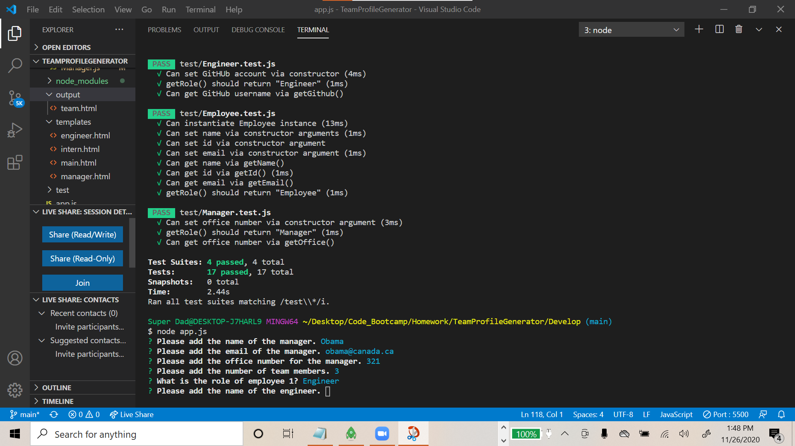
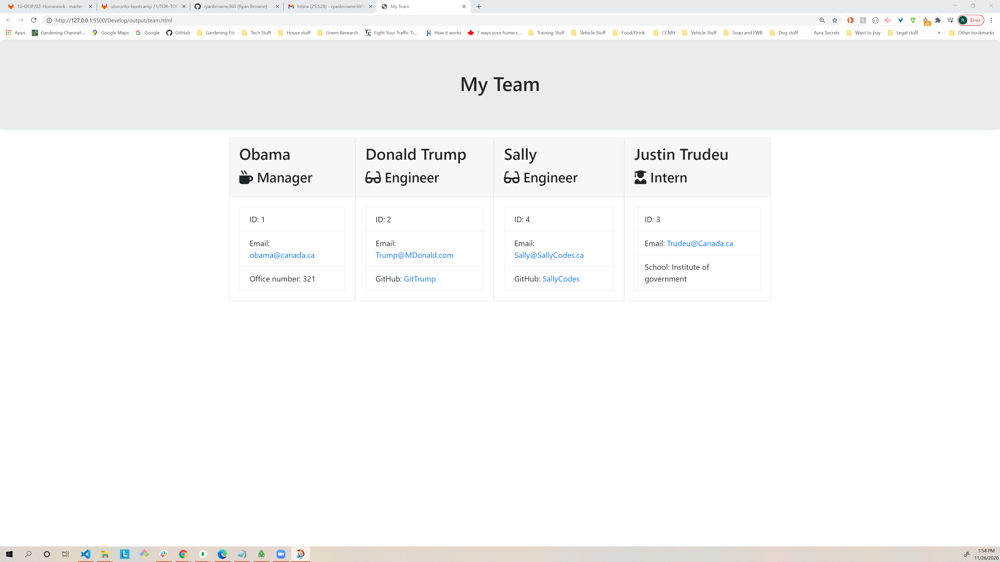

[**Team Profile Generator**](https://github.com/ryanbrowne360/TeamProfileGenerator.git)

Description:

This application is designed to be used as a command line interface. You can create a "team" via a series of prompts. The program will gather some crucial information about your team members and create an ID for them.

Installation:

The user needs to have Node.js installed, as well as the dependencies included in this program folder. They also need to have a browser which supports javascript. I recomend [Google Chrome](https://www.google.ca/chrome/). First, from the develop folder in your command line type "npm test". This will ensure that the js files in the test folder are able to execute effectively. Once this is successful, make sure you are in the main folder directory of this application in your terminal, and execute the command "node app.js". At this point you should be able to respond to the prompts shown in your CLI.

[Link to Application](https://github.com/ryanbrowne360/TeamProfileGenerator.git)

Usage:

This application makes it easy for the user to build a "team" via the command line UI. They can choose any number of team members. They can choose one manager, and decide whether the other team members are engineers or interns. Once they have completed answering the prompt questions, the application will finalize their data by rendering it into an html page for easy viewing. 

- *Google Chrome*
- *JavaScript*
- *Node.js*
- *HTML*
- *CSS*
- *Ryan Browne Software Developer* [Ryan Browne](https://github.com/ryanbrowne360/)

References:

- [W3 Schools](https://www.w3schools.com/)
- [npm inquirer](https://www.npmjs.com/package/inquirer)
- [npm jest](https://www.npmjs.com/package/jest)
- [Node.js](https://nodejs.org/en/)

License:

No License is required. You are free to use and modify this program as desired.

